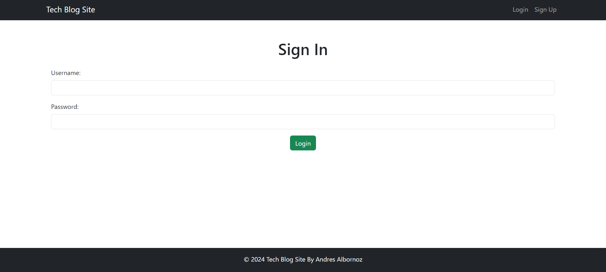

# Tech Blog

## Description
A web app where developers can publish their blog posts and comment on other developers’ posts as well.

## Table of Contents
- [Installation](#installation)
- [Usage](#usage)
- [Credits](#credits)
- [License](#license)
- [How to Contribute](#how-to-contribute)
- [Tests](#tests)

## Installation
This project does not require an installation. However, you are welcome to to either clone the repository and access the project files or fork the repo.

## Usage
Deployed on [.....](.........)

## Credits
Andres Albornoz

## License
This project is unlicensed.

## How to Contribute
I am currently not looking for contributors.

## Tests
Tested at the time of deployment.
